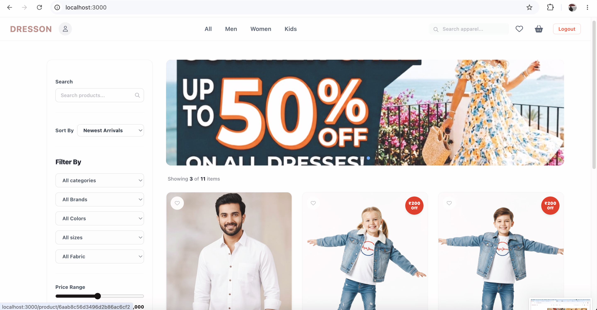
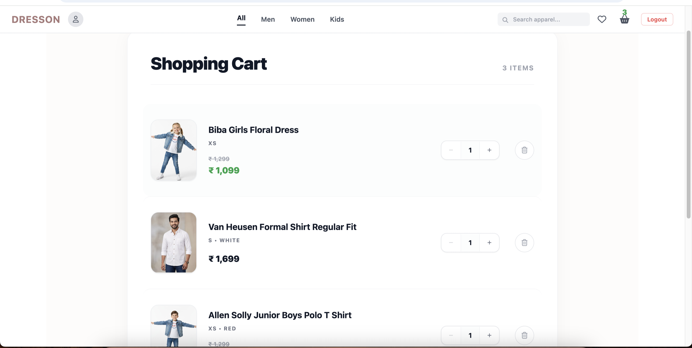
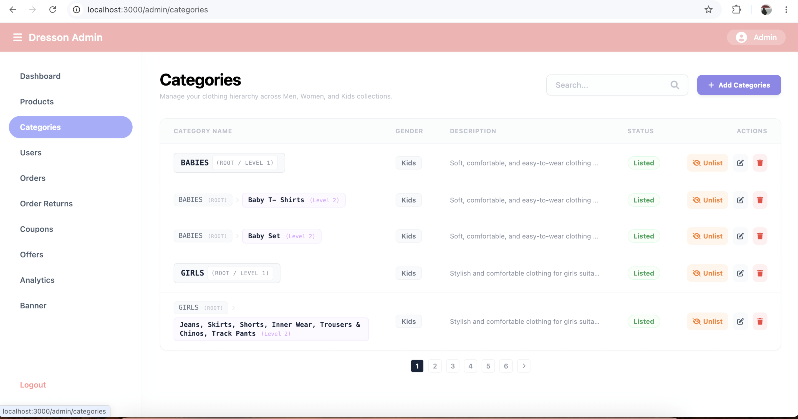
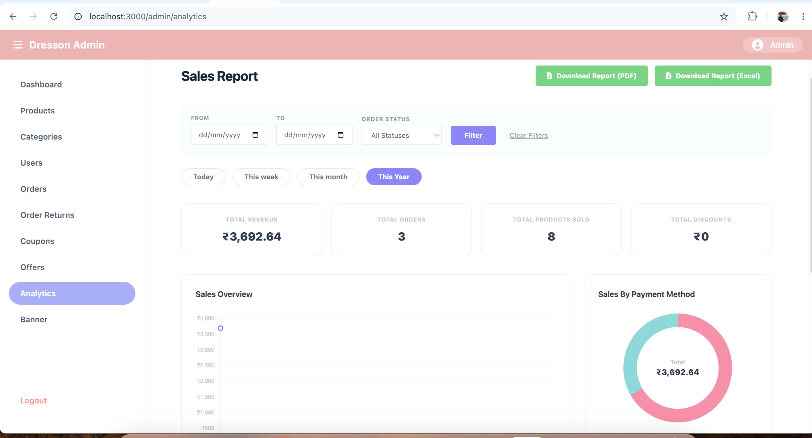
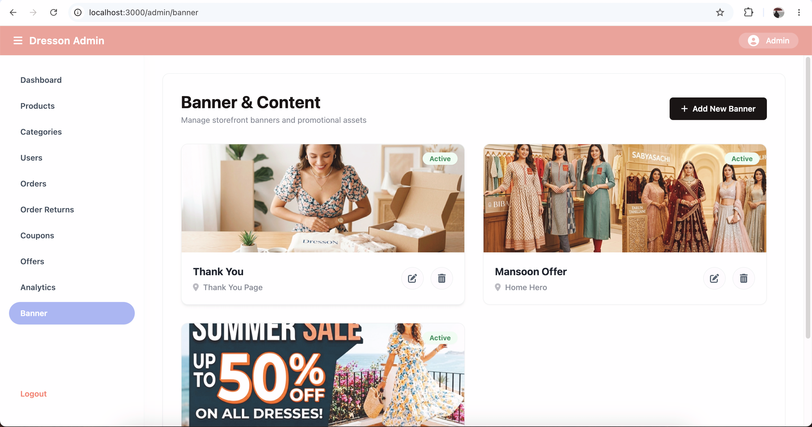

# Dresson
It is an e-commerce application for dress materials.

🌐 Live Site: [https://dresson.store](https://dresson.store)

## Features

- User authentication (signup / login / logout)
- Product listing with categories and filters
- Cart and checkout flow
- Order placement and order history
- Coupon and discount system
- Product reviews
- Admin dashboard for managing products, orders, and users
- Secure deployment with HTTPS

## Tech Stack

### Frontend

- HTML
- CSS
- JavaScript
- EJS Templates

### Backend

- Node.js
- Express.js

### Database & Storage

- MongoDB Atlas
- AWS S3
- Cloudinary

### Server & Deployment

- AWS EC2 (Linux)
- Nginx (Reverse Proxy)
- SSL via Certbot (Let’s Encrypt)

## Screenshots

### Home Page

### Cart

### Categories Admin

### Analytics

# Banner
